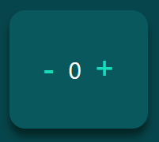
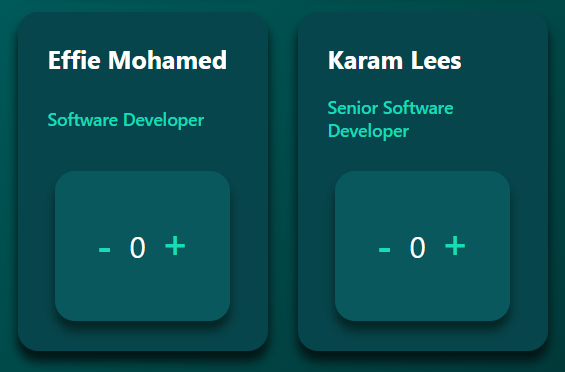

# :tickets: Ticket Tracker

This application was built using ReactJS. The app uses a data file composed of objects within an array. Each item in the array is a person that has a card associated with them, which can be used to add or subtract the number of tickets.

### :computer: Technologies used:

- HTML
- CSS/SCSS
- JavaScript
- ReactJs

### :pencil: Methods:

Props were used to pass down data from the array to each card which would be created using a map.  
The application consists of 3 components:
- Button
- Counter
- EmployeeCard

### :heavy_check_mark: Features:

The counter component was programmed such a way that the ticket count cannot equal anything less than zero.
The buttons on the left and right are used to decrement and increment the ticket count.

The card component was styled to ensure each card holds the same dimension no matter the length of the text inside. This helps to keep a uniform representation of all cards when aligned.

[Back to Profile](https://github.com/atif298)